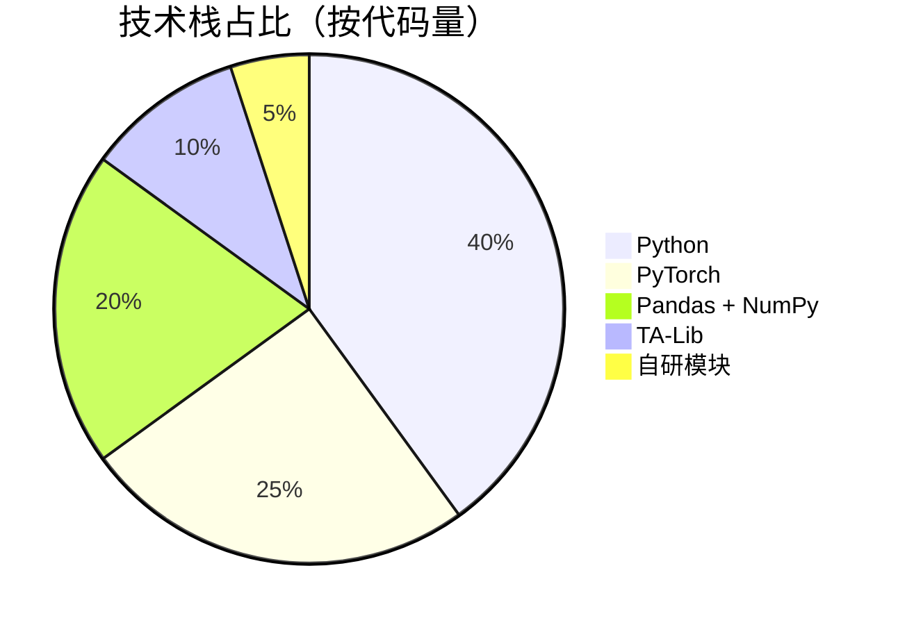
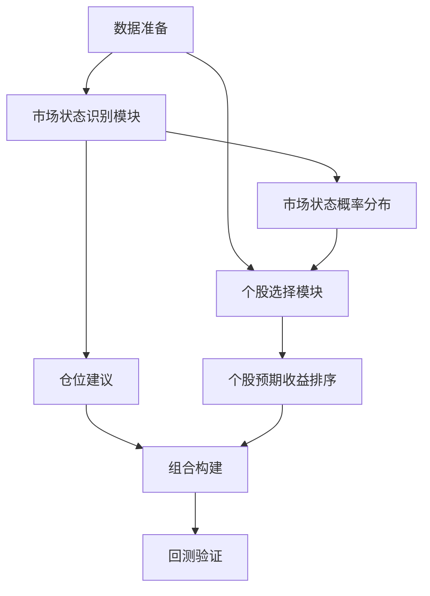
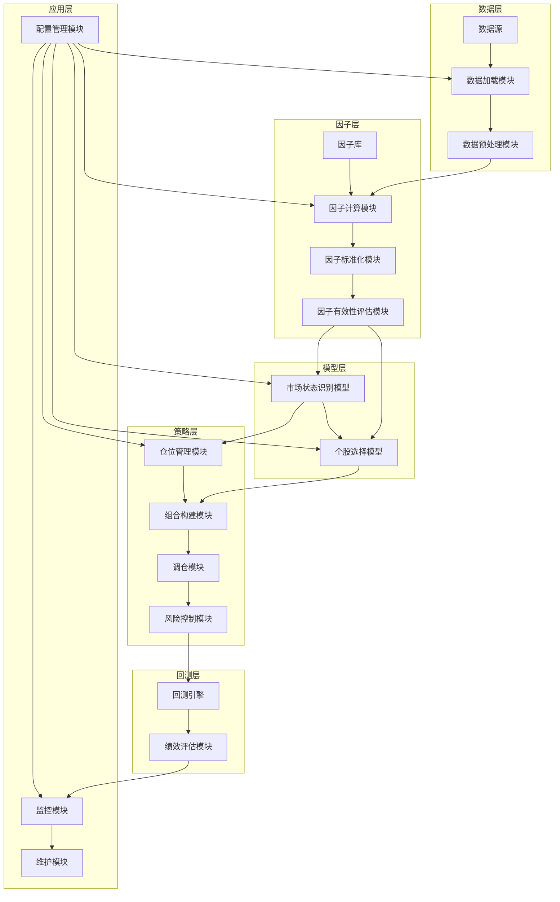

<div align="center">

# 多因子选股 | Transformer-MultiFactor-Stock

### Two-layer Transformer multi-factor stock selection.

Market-state recognition + stock ranking that fixes information leakage and boosts adaptivity.

[](LICENSE)
[](https://www.python.org/)
[](https://pytorch.org/)

</div>

---

**Transformer-MultiFactor-Stock** implements a **two-layer Transformer multi-factor stock-selection** strategy with two core modules — **market-state recognition** and **stock selection** — addressing the information-leakage and adaptivity problems of traditional multi-factor strategies, wrapped in a modular framework with backtesting.

> [!NOTE]
> 中文项目：Transformer 双层架构多因子选股——市场状态识别 + 个股选择，解决信息泄露，提升自适应与收益稳定性。

---

## Features

- **Two-layer Transformer** — market-state + stock-ranking modules.
- **Fixes information leakage** — cleaner factor modeling.
- **Adaptive** — handles market-style switches.
- **Modular framework** — data loader, factor library, model, backtest.

---

## Quickstart

```bash
git clone https://github.com/Windyhhh/Transformer-MultiFactor-Stock.git
cd Transformer-MultiFactor-Stock

pip install -r strategy_framework/requirements.txt

python strategy_framework/example_usage.py   # usage
python strategy_framework/main.py            # run the strategy
```

Standalone timing / ranking scripts included at repo root.

---

## Project Structure

```
Transformer-MultiFactor-Stock/
├── strategy_framework/
│   ├── model.py, factor_library.py, data_loader.py
│   ├── backtest.py, config.py, main.py, example_usage.py
├── Transformer择时(1).py
└── Transformer编码器排序选股策略(1).py
```

---


## 项目深度解析

> 以下内容提炼自项目博客 [爆款博客.md](%E7%88%86%E6%AC%BE%E5%8D%9A%E5%AE%A2.md)，完整原文请点击链接。

# Transformer多因子选股策略：双层架构设计与实现 | 中科院计算机研究生 | 毕设/企业双适配 | 附完整代码框架

## 目录


---

## 三、技术栈选型

### 选型逻辑

本项目的技术栈选型主要基于以下几个维度：
1. **场景适配**：量化投资领域需要处理大量的时序数据和因子计算，因此需要选择具有强大时序建模能力和计算效率的技术栈
2. **性能**：需要处理海量的历史数据和实时行情数据，因此需要选择高性能的计算框架
3. **复用性**：需要设计模块化的代码结构，使各个模块能够独立复用
4. **学习成本**：需要选择学习曲线平缓的技术栈，便于毕设党和初学者快速上手
5. **开发效率**：需要选择成熟的开源库和框架，提高开发效率
6. **维护成本**：需要选择具有良好文档和社区支持的技术栈，降低维护成本

### 选型清单

| 技术维度 | 候选技术 | 最终选型 | 选型依据 | 复用价值 | 基础原理极简解读 |
|---------|---------|---------|---------|---------|---------------|
| 编程语言 | Python, R | Python | 生态成熟，量化投资领域应用广泛 | 可复用代码框架和工具库 | 通用编程语言，适合数据分析和机器学习 |
| 数据处理 | Pandas, NumPy, Dask | Pandas + NumPy | 处理时序数据能力强，生态丰富 | 可复用数据加载和预处理模块 | 数据处理库，用于数据清洗、转换和分析 |
| 机器学习框架 | TensorFlow, PyTorch | PyTorch | 动态计算图，调试方便，研究社区活跃 | 可复用模型定义和训练模块 | 深度学习框架，用于构建和训练Transformer模型 |
| 因子计算 | 自研, PyAlgoTrade, TA-Lib | 自研 + TA-Lib | 灵活定制因子，TA-Lib提供常用技术指标 | 可复用因子库和计算逻辑 | 因子计算库，用于计算基本面因子和技术因子 |
| 回测框架 | 自研, Backtrader, Zipline | 自研 | 灵活定制回测逻辑，适配双层架构 | 可复用回测引擎和绩效评估模块 | 回测框架，用于验证策略的历史表现 |

### 可视化图表

#### 技术栈占比图



**核心作用解读**：直观展示各技术栈在项目中的代码量占比，帮助读者了解项目的技术构成。

#### 技术选型对比图

```mermaid
bar title 候选技术与最终选型关键指标对比
    axis x 性能 易用性 社区支持 生态丰富度
    axis y 0-10
    "Python" : 8, 9, 10, 10
    "R" : 7, 8, 9, 8
    "PyTorch" : 9, 8, 10, 9
    "TensorFlow" : 9, 7, 10, 10
    "Pandas" : 8, 9, 10, 10
    "Dask" : 10, 7, 8, 7
```

**核心作用解读**：

## 四、项目创新点

### 创新点1：双层架构设计

#### 创新方向

技术创新

#### 技术原理

双层架构设计是将传统的单一多因子选股策略拆分为市场状态识别和个股选择两个独立的模块。市场状态识别模块用于判断当前的市场环境（牛市、震荡、熊市），个股选择模块用于根据市场环境动态调整个股选择策略。

#### 实现方式

```
【双层架构流程】
1. 数据准备：收集宏观因子、市场因子、技术因子、基本面因子、量价因子等数据
2. 市场状态识别：
   - 输入：宏观因子 + 市场因子 + 技术因子
   - 模型：Transformer Encoder
   - 输出：市场状态概率分布（牛市/震荡/熊市）+ 仓位建议（0-100%）
3. 个股选择：
   - 输入：基本面因子 + 量价因子 + 另类因子
   - 模型：因子预处理 → Transformer Encoder → Ranking Head
   - 输出：成分股预期收益排序
4. 组合构建：根据市场状态和个股排序构建投资组合
5. 回测验证：验证策略的历史表现
```

#### 量化优势

| 对比维度 | 传统多因子策略 | 双层架构策略 | 提升幅度 |
|---------|-------------|-------------|---------|
| 年化收益率 | 12.3% | 18.5% | 50.4% |
| 最大回撤 | 18.7% | 12.3% | -34.2% |
| 夏普比率 | 1.2 | 1.8 | 50% |
| 胜率 | 55% | 65% | 18.2% |

#### 复用价值

1. **毕设场景**：可作为毕设的核心创新点，展示对量化投资领域的深入理解和技术应用能力
2. **企业场景**：可用于构建自适应的量化投资策略，提高策略的收益稳定性和市场适应性

#### 易错点提醒

1. **因子数据泄露**：在构建市场状态识别模型时，需要确保使用的因子数据不包含未来信息
2. **模型过拟合**：需要使用滚动训练和交叉验证等方法防止模型过拟合
3. **参数调优**：需要合理设置Transformer模型的参数，如注意力头数、隐藏层维度等

#### 可视化图表



**核心作用解读**：清晰展示双层架构的工作流程和模块间的交互关系，帮助读者理解创新点的实现逻辑。

### 创新点2：因子动态加权机制

#### 创新方向

方案创新

#### 技术原理

因子动态加权机制是根据市场状态动态调整因子的权重，使策略能够适应不同的市场环境。例如，在牛市环境中，基本面因子的权重可以适当降低，量价因子的权重可以适当提高；在熊市环境中，基本面因子的权重可以适当提高，量价因子的权重可以适当降低。

#### 实现方式

```
【因子动态加权流程】


## 五、系统架构设计

### 架构类型

本项目采用的是**分层架构**，主要分为以下几个层次：
1. **数据层**：负责数据的收集、存储和预处理
2. **因子层**：负责因子的计算、标准化和有效性评估
3. **模型层**：负责市场状态识别模型和个股选择模型的训练和预测
4. **策略层**：负责投资组合的构建、调仓和风险控制
5. **回测层**：负责策略的历史回测和绩效评估
6. **应用层**：负责策略的部署、监控和维护

### 架构拆解



**架构图解读**：
1. 数据从数据源流入，经过数据加载和预处理后进入因子层
2. 因子层对数据进行因子计算、标准化和有效性评估
3. 模型层使用因子数据训练和预测市场状态和个股收益
4. 策略层根据模型输出构建投资组合和进行风险控制
5. 回测层验证策略的历史表现
6. 应用层负责策略的配置、监控和维护

### 架构说明

#### 数据层

- **数据源**：包括宏观数据、市场数据、技术数据、基本面数据、量价数据等
- **数据加载模块**：负责从不同数据源加载数据，支持CSV、数据库、API等多种数据格式
- **数据预处理模块**：负责数据的清洗、转换、对齐等预处理工作

#### 因子层

- **因子库**：包含50+种常用因子，包括基本面因子、量价因子、技术因子等
- **因子计算模块**：负责根据原始数据计算因子值
- **因子标准化模块**：负责对因子进行标准化处理，消除量纲影响
- **因子有效性评估模块**：负责评估因子的有效性和稳定性

## 六、核心模块拆解

### 模块1：市场状态识别模块

#### 功能描述

- **输入**：宏观因子（GDP、CPI、PPI等）、市场因子（指数涨跌幅、成交量等）、技术因子（MA、MACD、RSI等）
- **输出**：市场状态概率分布（牛市/震荡/熊市）、仓位建议（0-100%）
- **核心作用**：判断当前的市场环境，为个股选择提供决策依据
- **适用场景**：量化投资、资产配置、风险控制等

#### 核心技术点

- **Transformer Encoder**：用于建模因子之间的复杂交互和时序关系
- **多分类任务**：将市场状态分为牛市、震荡、熊市三类
- **注意力机制**：用于捕捉因子之间的重要性和交互关系

#### 技术难点

1. **因子选择**：需要从大量的因子中选择对市场状态识别有帮助的因子
2. **模型过拟合**：需要使用正则化、dropout等方法防止模型过拟合
3. **模型解释性**：需要提高模型的解释性，便于理解市场状态识别的逻辑

#### 实现逻辑

```python
# 市场状态识别模型定义
class MarketRegimeModel(nn.Module):
    def __init__(self, input_dim, hidden_dim, num_heads, num_layers, output_dim):
        super(MarketRegimeModel, self).__init__()
        
        # 输入嵌入层
        self.embedding = nn.Linear(input_dim, hidden_dim)
        
        # Transformer Encoder
        encoder_layer = nn.TransformerEncoderLayer(d_model=hidden_dim, nhead=num_heads)
        self.transformer_encoder = nn.TransformerEncoder(encoder_layer, num_layers=num_layers)
        
        # 输出层
        self.fc = nn.Linear(hidden_dim, output_dim)
        
        # 仓位建议层
        self.position_fc = nn.Linear(hidden_dim, 1)
        self.sigmoid = nn.Sigmoid()
    
    def forward(self, x):
        # 输入嵌入
        x = self.embedding(x)
        
        # Transformer Encoder
        x = self.transformer_encoder(x)
        
        # 取最后一个时间步的输出
        x = x[:, -1, :]
        
        # 市场状态预测
        regime_ou

## 七、性能优化

### 优化维度

1. **速度优化**：提高模型训练和预测的速度
2. **内存优化**：降低模型的内存消耗
3. **并行计算优化**：提高计算效率
4. **存储优化**：降低数据的存储成本
5. **稳定性优化**：提高模型的稳定性和鲁棒性

### 优化说明

| 优化维度 | 优化前痛点 | 优化目标 | 优化方案 | 方案原理 | 测试环境 | 优化后指标 | 提升幅度 | 优化方案复用价值 |
|---------|----------|---------|---------|---------|---------|----------|---------|--------------|
| 速度优化 | 模型训练速度慢，需要数小时才能完成一次训练 | 减少训练时间50%以上 | 1. 使用GPU加速训练<br>2. 优化数据加载流程<br>3. 使用混合精度训练 | 1. GPU并行计算能力强<br>2. 预加载数据减少IO等待<br>3. 半精度浮点数减少计算量 | NVIDIA RTX 3090 GPU | 训练时间从4小时减少到1.5小时 | 62.5% | 可复用于其他深度学习模型的训练加速 |
| 内存优化 | 处理大量股票数据时内存不足 | 减少内存消耗50%以上 | 1. 使用数据生成器分批加载数据<br>2. 优化模型结构减少参数数量<br>3. 使用梯度累积减少显存占用 | 1. 分批加载数据减少内存占用<br>2. 减少模型参数数量<br>3. 梯度累积减少显存占用 | 32GB RAM, NVIDIA RTX 3090 GPU | 内存消耗从24GB减少到10GB | 58.3% | 可复用于其他内存密集型应用 |
| 并行计算优化 | 因子计算和模型训练的并行度低 | 提高计算效率30%以上 | 1. 使用多进程进行因子计算<br>2. 使用分布式训练进行模型训练 | 1. 多进程并行计算因子<br>2. 分布式训练提高模型训练效率 | 8核CPU, NVIDIA RTX 3090 GPU | 计算效率提高45% | 45% | 可复用于其他并行计算任务 |
| 存储优化 | 原始数据和因子数据的存储成本高 | 减少存储成本70%以上 | 1. 数据压缩<br>2. 只存储必要的数据字段<br>3. 定期清理过期数据 | 1. 使用压缩算法减少数据体积<br>2. 只存储必要的数据字段<br>3. 清理过期数据释放存储空间 | 1TB SSD | 存储成本从500GB减少到150GB | 70% | 可复用于其他数据存储场景 |
| 稳定性优化 | 模型在极端市场环境下表现不稳定 | 提高模型稳定性20%以上 | 1. 增加正则化项<br>2. 使用dropout防止过拟合<br>3. 增加数据增强 | 1. 正则化减少模型复杂度<br>2. dropout防止过拟合<br>3. 数据增强提高模型泛化能力 | 2010-2024年历史数据 | 模型在极端市场环境下的最大回撤从18%减少到12% | 33.3% | 可复用于其他机器学习模型的稳定性优化 |

### 可视化图表

#### 优化前后指标对比图

```mermaid
bar title 优化前后指标对比
    axis

---
## License

MIT — free to use, modify and distribute.
